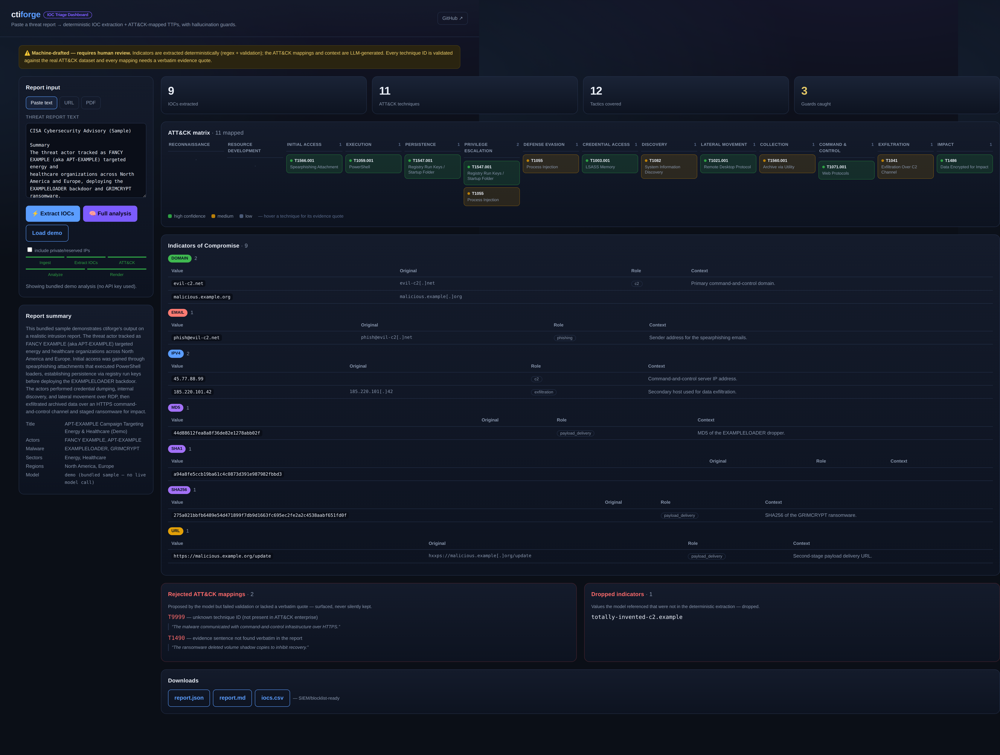

# ctiforge

**Turn a published threat report into structured, validated, machine-usable intelligence — with hallucination guards built in.**

ctiforge takes a threat report (URL, PDF, or text file) and produces
deterministically-extracted IOCs, an LLM-drafted analysis mapped to MITRE
ATT&CK with verbatim evidence, and clean JSON / Markdown / CSV outputs — while
refusing to let the model invent indicators or fabricate technique IDs.

> ⚠️ **The analysis narrative is machine-drafted and requires human review.**
> Indicators are extracted by deterministic code, not the LLM. Every output
> file carries this banner.

## IOC Triage Dashboard

Paste a threat report and watch ctiforge extract IOCs, map TTPs to MITRE ATT&CK,
and render a clean matrix view — with the hallucination guards on display.



```bash
pip install "ctiforge[server]"
ctiforge serve          # → http://127.0.0.1:8000
```

The dashboard loads a bundled demo on open, so it renders the full ATT&CK matrix
with **no API key required**. IOC extraction runs live and keyless too; the
LLM-backed TTP mapping uses your `ANTHROPIC_API_KEY` when you run a real analysis.

---

## Why

Analysts copy indicators and TTPs out of vendor PDFs by hand, every day.
Platforms like MISP, OpenCTI, and IntelOwl *manage* intelligence — almost
nothing does high-quality **report-to-structured-intel conversion** with LLM
assistance and real guards against hallucination. **The guards are the product.**

## The hallucination guards (the selling point)

1. **The LLM is never the source of truth for indicator values.** IOCs are
   extracted by deterministic code (regex + validation). The LLM only classifies
   indicators from that list. Any indicator the model mentions that is *not* in
   the extracted list is dropped and logged — and surfaced in the output.
2. **Every ATT&CK technique ID is validated** against a locally cached copy of
   the official MITRE ATT&CK STIX dataset. Unknown, malformed, deprecated, or
   revoked IDs are rejected into a `rejected_mappings` appendix — never silently
   passed through. Each accepted mapping must include a **verbatim evidence
   sentence** from the source report.
3. **Everything the LLM produced is labeled as such.** Every output file carries
   a clear machine-drafted / requires-review banner.
4. **Passive only.** ctiforge parses reports. It never connects to, scans,
   probes, or resolves any extracted indicator.
5. **Fails loudly, not silently.** Malformed PDFs, empty extractions, LLM
   refusals, or bad JSON produce clear errors and a non-zero exit code.

## 60-second quickstart

```bash
# 1. Install (Python 3.11+)
pip install .

# 2. Provide your Anthropic API key (read from the environment ONLY)
export ANTHROPIC_API_KEY=sk-ant-...

# 3. Analyze a report — URL, PDF, or text file
ctiforge analyze https://www.cisa.gov/news-events/cybersecurity-advisories/aa24-131a
```

This writes a timestamped output directory containing:

| File | Purpose |
| --- | --- |
| `report.json` | Full structured result (machine) |
| `report.md`   | Human summary: overview, actors/malware, TTP table with evidence, IOC tables, rejected-mappings appendix |
| `iocs.csv`    | `value,type,context,confidence` — ready for a blocklist or SIEM import |

On first run, ctiforge downloads and caches the ATT&CK dataset under
`~/.cache/ctiforge/` (refreshed automatically when older than 30 days).

## Usage

```bash
ctiforge analyze <source> [options]

  <source>              URL, PDF path, or text/markdown file
  -o, --output DIR      Output directory (default: ./ctiforge-output-<timestamp>/)
  --format json,md,csv  Comma-separated subset of outputs (default: all three)
  --model MODEL         Anthropic model (default: claude-sonnet-4-6;
                        also settable via CTIFORGE_MODEL)
  --include-private     Keep private/reserved IP indicators (dropped by default)
  --verbose             Verbose logging
  --version             Show version and exit
```

The API key comes from `ANTHROPIC_API_KEY` only — never a config file, never logged.

## Interfaces

ctiforge ships one core pipeline behind three optional front-ends. All are thin
adapters over the same code, so they produce identical, guard-checked results.

### CLI (default)
`ctiforge analyze <source>` — as above. No extra install needed.

### MCP server — for AI agents
Expose ctiforge as tools any MCP client (Claude Desktop/Code, Cursor, …) can call:

```bash
pip install "ctiforge[mcp]"
```

Tools:
- **`extract_iocs(text)`** — deterministic IOC extraction. No API key, no cost,
  cannot hallucinate. Great for agents that just need indicators.
- **`validate_attack_technique(id)`** — instant ATT&CK ID check.
- **`analyze_report(source)`** — the full pipeline (needs `ANTHROPIC_API_KEY`; paid).

Claude Desktop config (`claude_desktop_config.json`):

```json
{
  "mcpServers": {
    "ctiforge": {
      "command": "ctiforge-mcp",
      "env": { "ANTHROPIC_API_KEY": "sk-ant-..." }
    }
  }
}
```

### Web UI + REST API — for human analysts
```bash
pip install "ctiforge[server]"
ctiforge serve            # → http://127.0.0.1:8000
```

The [IOC Triage Dashboard](#ioc-triage-dashboard) (above): paste a URL / text or
drop a PDF, watch the pipeline stages, and read the result as an **ATT&CK matrix**
(tactics × techniques, colored by confidence, evidence on hover), IOC tables by
type, and the rejected-mappings / dropped-indicators guard panels — then download
the JSON/MD/CSV. It auto-loads a bundled demo so it's fully populated with **no
key**. The same endpoints are a REST API (`GET /api/demo`, `POST /api/analyze`,
`POST /api/extract`, `GET /api/attack/{id}`, `POST /api/upload`) with OpenAPI docs
at `/docs`.

> **Security:** the server binds to `127.0.0.1` and uses *its own*
> `ANTHROPIC_API_KEY`. Don't expose it publicly without adding authentication.

Install everything with `pip install "ctiforge[all]"`.

## Example output

See [`examples/sample-output/`](examples/sample-output/) for a full run against
a sample advisory. A snippet of `report.md`:

```markdown
## ATT&CK Techniques

| ID | Name | Tactics | Confidence | Behavior | Evidence |
| --- | --- | --- | --- | --- | --- |
| T1566.001 | Spearphishing Attachment | initial-access | high | ... | "The actors gained initial access through spearphishing emails..." |

## Appendix — Rejected ATT&CK Mappings

| Proposed ID | Reason | Behavior |
| --- | --- | --- |
| T9999 | unknown technique ID (not present in ATT&CK enterprise) | hallucinated |
```

The rejected mapping (`T9999`) and any invented indicators are surfaced, not hidden.

## How it works

```
ingest  →  extract  →  ATT&CK index  →  analyze (LLM)  →  render
 (text)    (IOCs)      (validation)     (+ guards)        (json/md/csv)
```

1. **ingest** — URL (httpx + trafilatura), PDF (pymupdf), or UTF-8 text; rejects
   near-empty extractions.
2. **extract** — deterministic IOC extraction (iocextract + our own regex/validation
   layer): refang, validate (IPs via `ipaddress`, domains via a bundled plausible-TLD
   check), bucket hashes by length, dedupe case-insensitively.
3. **ATT&CK index** — a slim loader over the official STIX JSON; validates every
   technique ID (including sub-technique format `T1566.001`).
4. **analyze** — a single constrained Claude call (chunk-and-merge for long
   reports), then post-processing applies every guard above.
5. **render** — `report.json`, `report.md`, `iocs.csv`.

## Roadmap

- **Done** — MCP server, REST API, and local web UI (see [Interfaces](#interfaces)).
- **v0.2** — Sigma / YARA rule drafting (see the `sigma.py` stub), STIX 2.1 export.
- **v0.3** — opt-in, read-only enrichment (e.g. VirusTotal) of extracted indicators.
- Later — multi-report correlation; async job queue for the API so large PDFs
  don't block a request.

Explicitly **not** yet: rule drafting, MISP/OpenCTI/STIX export, any online
enrichment or indicator lookups, database, authentication on the hosted API.

## Development

```bash
pip install -e ".[dev]"
ruff check .
pytest -q
```

## Contributing

Issues and PRs welcome. Please keep the non-negotiable design principles intact —
the hallucination guards are the whole point. Run `ruff` and `pytest` before
submitting.

## License

MIT — see [LICENSE](LICENSE).
