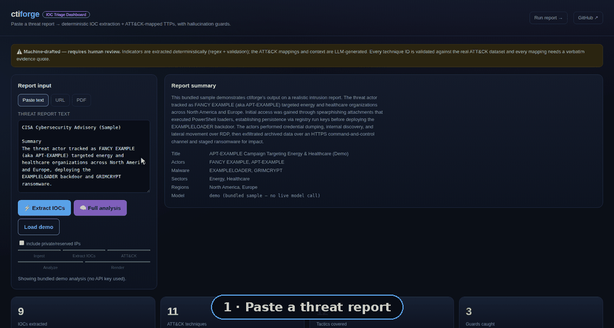
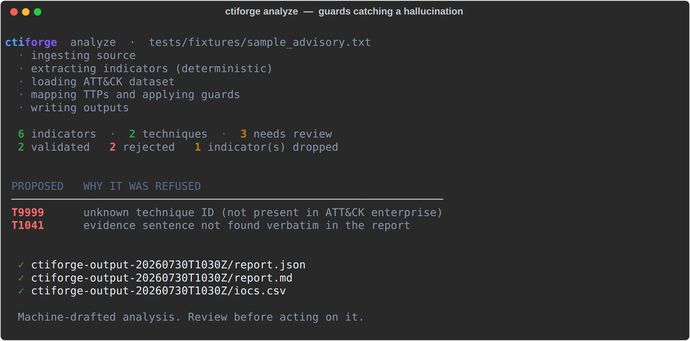
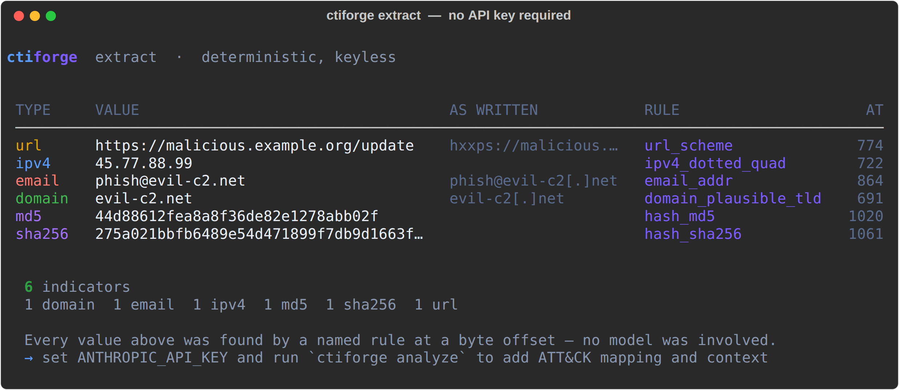
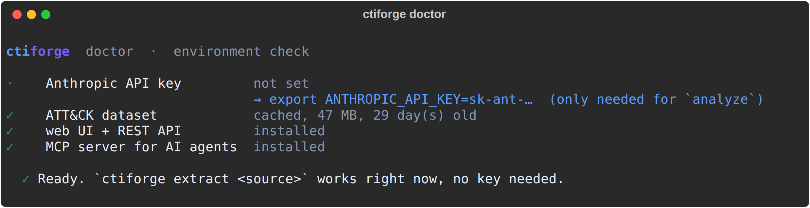
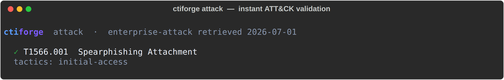
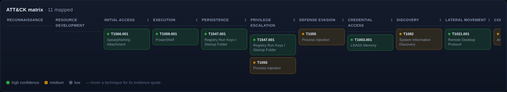
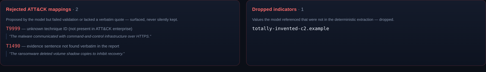
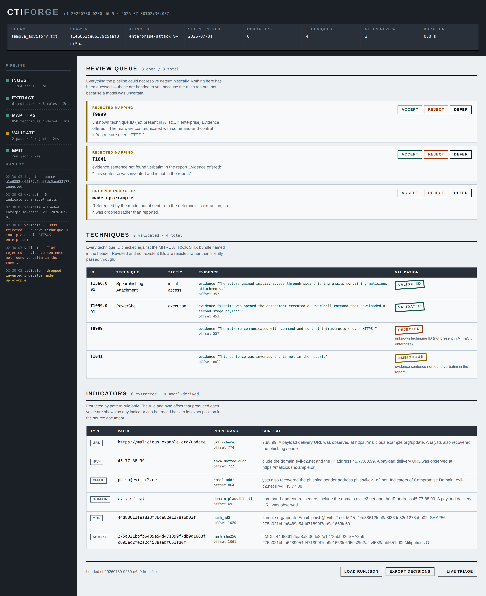

# ctiforge

**Turn a published threat report into structured, validated, machine-usable intelligence — with hallucination guards built in.**

ctiforge takes a threat report (URL, PDF, or text file) and produces
deterministically-extracted IOCs, an LLM-drafted analysis mapped to MITRE
ATT&CK with verbatim evidence, and clean JSON / Markdown / CSV outputs — while
refusing to let the model invent indicators or fabricate technique IDs.

> ⚠️ **The analysis narrative is machine-drafted and requires human review.**
> Indicators are extracted by deterministic code, not the LLM. Every output
> file carries this banner.

## IOC Triage Dashboard

Paste a threat report and watch ctiforge extract IOCs, map TTPs to MITRE ATT&CK,
and render a clean matrix view — with the hallucination guards on display.



<sub>Animated demo — see the [full-resolution still](docs/img/dashboard.png).</sub>

```bash
pip install "ctiforge[server]"
ctiforge serve          # → http://127.0.0.1:8000
```

The dashboard loads a bundled demo on open, so it renders the full ATT&CK matrix
with **no API key required**. IOC extraction runs live and keyless too; the
LLM-backed TTP mapping uses your `ANTHROPIC_API_KEY` when you run a real analysis.

---

## Why

Analysts copy indicators and TTPs out of vendor PDFs by hand, every day.
Platforms like MISP, OpenCTI, and IntelOwl *manage* intelligence — almost
nothing does high-quality **report-to-structured-intel conversion** with LLM
assistance and real guards against hallucination. **The guards are the product.**

## The hallucination guards (the selling point)

1. **The LLM is never the source of truth for indicator values.** IOCs are
   extracted by deterministic code (regex + validation). The LLM only classifies
   indicators from that list. Any indicator the model mentions that is *not* in
   the extracted list is dropped and logged — and surfaced in the output.
   You don't have to take this on faith: `ctiforge extract` runs that half of the
   pipeline on its own, with **no API key and no network**, and prints the rule
   and byte offset behind every single value.
2. **Every ATT&CK technique ID is validated** against a locally cached copy of
   the official MITRE ATT&CK STIX dataset. Unknown, malformed, deprecated, or
   revoked IDs are rejected into a `rejected_mappings` appendix — never silently
   passed through. Each accepted mapping must include a **verbatim evidence
   sentence** from the source report.
3. **Everything the LLM produced is labeled as such.** Every output file carries
   a clear machine-drafted / requires-review banner.
4. **Passive only.** ctiforge parses reports. It never connects to, scans,
   probes, or resolves any extracted indicator.
5. **Fails loudly, not silently.** Malformed PDFs, empty extractions, LLM
   refusals, or bad JSON produce clear errors and a non-zero exit code.

### The guard catching a real hallucination

Not hypothetical — this is `run.json` from an actual run. The model proposed
**T1041** (Exfiltration Over C2 Channel), a real ATT&CK technique, and cited a
sentence as its evidence. That sentence does not appear anywhere in the source
report. The model invented its own justification.

Guard #2 requires the evidence quote to be found verbatim in the source text, so
the mapping never reached the report:

```jsonc
{
  "id": "T1041",
  "match": "evidence:“This sentence was invented and is not in the report.”",
  "offset": null,                    // ← quote not locatable in the source
  "validation": "ambiguous",
  "provenance": "llm-mapped, rejected by guard",
  "note": "evidence sentence not found verbatim in the report"
}
```

Compare an accepted mapping from the same run — its quote resolves to a byte
offset in the source, so it stands:

```jsonc
{
  "id": "T1566.001",
  "match": "evidence:“The actors gained initial access through spearphishing emails containing malicious attachments.”",
  "offset": 357,                     // ← found at this position in the report
  "validation": "validated"
}
```

The rejected mapping is not discarded quietly either — it lands in the review
queue for a human, with the fabricated quote attached so the call is auditable:

```jsonc
{
  "id": "r2",
  "kind": "Rejected mapping",
  "ref": "T1041",
  "reason": "evidence sentence not found verbatim in the report. Evidence offered: “This sentence was invented and is not in the report.”"
}
```

A plausible technique ID with a fabricated citation is exactly the failure mode
that makes LLM-assisted CTI untrustworthy, and exactly what ctiforge exists to
catch. Note that a *wrong-but-real* ID is caught by a different guard: in the same
run `T9999` was rejected as `not present in ATT&CK enterprise`.

Both refusals, as the CLI reports them:



## 10-second quickstart — no API key needed

```bash
pip install .
ctiforge extract report.pdf
```

That's it. `extract` is fully deterministic: no API key, no network calls, no cost,
and **it cannot hallucinate** — every value comes from a named rule at a byte
offset in the source.



Add `--json` for machines, `-o DIR` to write `iocs.csv`, `--context` to see the
snippet each rule matched.

Not sure your setup is right? `ctiforge doctor` tells you exactly what's missing
and how to fix it. Want to check a single technique ID? `ctiforge attack T1566.001`
(also keyless, exits non-zero if the ID isn't real).

## Full analysis (needs a key)

```bash
export ANTHROPIC_API_KEY=sk-ant-...        # environment only, never a config file
ctiforge analyze https://www.cisa.gov/news-events/cybersecurity-advisories/aa24-131a
```

This adds the LLM layer — executive summary, threat actors, malware families,
targeting, and ATT&CK mappings — with every guard applied. **If the key is
missing, `analyze` still writes the deterministic results** rather than
discarding the work it already did, and tells you what the key would add.

It writes a timestamped output directory containing:

| File | Purpose |
| --- | --- |
| `report.json` | Full structured result (machine) |
| `report.md`   | Human summary: overview, actors/malware, TTP table with evidence, IOC tables, rejected-mappings appendix |
| `iocs.csv`    | `value,type,context,confidence` — ready for a blocklist or SIEM import |

On first run, ctiforge downloads and caches the ATT&CK dataset under
`~/.cache/ctiforge/` (refreshed automatically when older than 30 days).

## Commands

| Command | Needs a key? | What it does |
| --- | --- | --- |
| `ctiforge extract <source>` | **no** | Deterministic IOC extraction with rule + offset provenance |
| `ctiforge attack <ID>` | **no** | Validate one ATT&CK technique ID against the real dataset |
| `ctiforge doctor` | **no** | Check your setup and tell you how to fix what's missing |
| `ctiforge analyze <source>` | yes* | Adds summary, actors, malware, and ATT&CK mapping |
| `ctiforge serve` | no** | Web UI + REST API (`ctiforge[server]`) |

<sub>\* degrades gracefully to the deterministic results without one. \*\* the dashboard loads a bundled demo, so it's browsable with no key.</sub>

```bash
ctiforge extract <source> [options]
  -o, --output DIR      Write iocs.csv to this directory
  --context             Show the source snippet each rule matched
  --include-private     Keep private/reserved IP indicators (dropped by default)
  --json                Emit JSON on stdout instead

ctiforge analyze <source> [options]
  -o, --output DIR      Output directory (default: ./ctiforge-output-<timestamp>/)
  --format json,md,csv  Comma-separated subset of outputs (default: all three)
  --model MODEL         Anthropic model (default: claude-sonnet-4-6;
                        also settable via CTIFORGE_MODEL)
  --include-private     Keep private/reserved IP indicators (dropped by default)
  --report PATH         Also write a run.json artifact (see "Run report" below)
  --decisions PATH      Apply verdicts from a decisions file to the review queue
  --verbose             Show why each rejected mapping was refused
```

Exit codes: `0` success · `1` failure · `2` usage error, or an invalid technique
ID from `attack`. Shell completion: `ctiforge --install-completion`.

The API key comes from `ANTHROPIC_API_KEY` only — never a config file, never logged.

## Run report

`--report` writes a `run.json` artifact (schema `ctiforge.run/1`) describing the
run: source hash, ATT&CK dataset used, per-stage timings, the run log, the review
queue, and every technique and indicator with its provenance.

```bash
ctiforge analyze report.pdf --report run.json
```

Then open the viewer — `ctiforge dashboard` (no server needed), or visit `/run`
while `ctiforge serve` is running. It is a single file with **no external
requests of any kind**, so it is safe for incident data and works air-gapped
(single file, no build step, no backend), click **Load run.json**, and pick the
file. Review decisions can be exported back out as `ctiforge.decisions/1` and
replayed so resolved items don't reappear:

```bash
ctiforge analyze report.pdf --report run.json --decisions run-decisions.json
```

**Provenance is explicit about its source.** Indicators are extracted
deterministically, so each carries the extraction `rule` that fired plus its byte
`offset` into the analyzed text. Technique mappings come from the guarded LLM
stage — *not* a keyword rule engine — so instead of dressing that up as a pattern
match, each technique's `match` is the verbatim evidence sentence the mapping was
required to quote, `offset` is where that sentence occurs in the report, and
`provenance` names the mechanism. Every `validation` value
(`validated` / `rejected` / `ambiguous`) is the real result of the STIX check.

## Interfaces

ctiforge ships one core pipeline behind three optional front-ends. All are thin
adapters over the same code, so they produce identical, guard-checked results.

### CLI (default)
`ctiforge analyze <source>` — as above. No extra install needed.

### MCP server — for AI agents
Expose ctiforge as tools any MCP client (Claude Desktop/Code, Cursor, …) can call:

```bash
pip install "ctiforge[mcp]"
```

Tools:
- **`extract_iocs(text)`** — deterministic IOC extraction. No API key, no cost,
  cannot hallucinate. Great for agents that just need indicators.
- **`validate_attack_technique(id)`** — instant ATT&CK ID check.
- **`analyze_report(source)`** — the full pipeline (needs `ANTHROPIC_API_KEY`; paid).

Claude Desktop config (`claude_desktop_config.json`):

```json
{
  "mcpServers": {
    "ctiforge": {
      "command": "ctiforge-mcp",
      "env": { "ANTHROPIC_API_KEY": "sk-ant-..." }
    }
  }
}
```

### Web UI + REST API — for human analysts
```bash
pip install "ctiforge[server]"
ctiforge serve            # → http://127.0.0.1:8000
```

The [IOC Triage Dashboard](#ioc-triage-dashboard) (above): paste a URL / text or
drop a PDF, watch the pipeline stages, and read the result as an **ATT&CK matrix**
(tactics × techniques, colored by confidence, evidence on hover), IOC tables by
type, and the rejected-mappings / dropped-indicators guard panels — then download
the JSON/MD/CSV. It auto-loads a bundled demo so it's fully populated with **no
key**. The same endpoints are a REST API (`GET /api/demo`, `POST /api/analyze`,
`POST /api/extract`, `GET /api/attack/{id}`, `POST /api/upload`) with OpenAPI docs
at `/docs`.

> **Security:** the server binds to `127.0.0.1` and uses *its own*
> `ANTHROPIC_API_KEY`. Don't expose it publicly without adding authentication.

Install everything with `pip install "ctiforge[all]"`.

## Example output

See [`examples/sample-output/`](examples/sample-output/) for a full run against
a sample advisory. A snippet of `report.md`:

```markdown
## ATT&CK Techniques

| ID | Name | Tactics | Confidence | Behavior | Evidence |
| --- | --- | --- | --- | --- | --- |
| T1566.001 | Spearphishing Attachment | initial-access | high | ... | "The actors gained initial access through spearphishing emails..." |

## Appendix — Rejected ATT&CK Mappings

| Proposed ID | Reason | Behavior |
| --- | --- | --- |
| T9999 | unknown technique ID (not present in ATT&CK enterprise) | hallucinated |
```

The rejected mapping (`T9999`) and any invented indicators are surfaced, not hidden.

## How it works

```
ingest  →  extract  →  ATT&CK index  →  analyze (LLM)  →  render
 (text)    (IOCs)      (validation)     (+ guards)        (json/md/csv)
```

1. **ingest** — URL (httpx + trafilatura), PDF (pymupdf), or UTF-8 text; rejects
   near-empty extractions.
2. **extract** — deterministic IOC extraction (iocextract + our own regex/validation
   layer): refang, validate (IPs via `ipaddress`, domains via a bundled plausible-TLD
   check), bucket hashes by length, dedupe case-insensitively.
3. **ATT&CK index** — a slim loader over the official STIX JSON; validates every
   technique ID (including sub-technique format `T1566.001`).
4. **analyze** — a single constrained Claude call (chunk-and-merge for long
   reports), then post-processing applies every guard above.
5. **render** — `report.json`, `report.md`, `iocs.csv`.

## Roadmap

- **Done** — MCP server, REST API, and local web UI (see [Interfaces](#interfaces)).
- **v0.2** — Sigma / YARA rule drafting (see the `sigma.py` stub), STIX 2.1 export.
- **v0.3** — opt-in, read-only enrichment (e.g. VirusTotal) of extracted indicators.
- Later — multi-report correlation; async job queue for the API so large PDFs
  don't block a request.

Explicitly **not** yet: rule drafting, MISP/OpenCTI/STIX export, any online
enrichment or indicator lookups, database, authentication on the hosted API.

## Gallery

<table>
<tr>
<td width="50%" valign="top">

**Setup check — `ctiforge doctor`**

Tells you what's missing and the exact command to fix it.



</td>
<td width="50%" valign="top">

**Technique lookup — `ctiforge attack`**

Keyless, instant; exits non-zero when an ID isn't real.



</td>
</tr>
</table>

**ATT&CK matrix** — techniques placed under every tactic they belong to, coloured
by confidence. Hover any chip for its verbatim evidence quote.



**The guards, on screen** — rejected mappings and dropped indicators get their own
panels. Nothing the model got wrong is quietly discarded.



**Run report viewer** — load a `run.json` for the full provenance trail: per-stage
timings, the run log, the review queue, and the rule + byte offset behind every
indicator. Single file, no server required, and it makes no network requests.



## Development

```bash
pip install -e ".[dev]"
ruff check .
pytest -q
```

## Contributing

Issues and PRs welcome. Please keep the non-negotiable design principles intact —
the hallucination guards are the whole point. Run `ruff` and `pytest` before
submitting.

## License

MIT — see [LICENSE](LICENSE).
